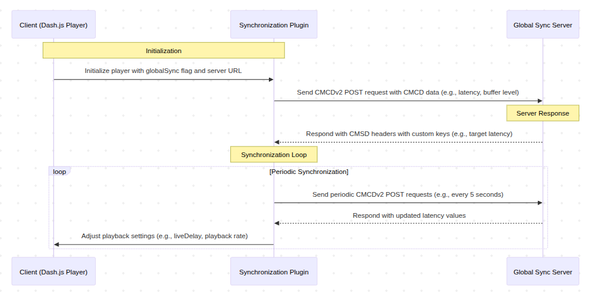

# Global Synchronization Server

This project demonstrates global synchronization for media playback. It includes:
- A **server** built with Node.js and Express to manage synchronization and latency adjustments.
- A **client** using Dash.js with a custom synchronization plugin for media playback.

## Prerequisites
- **Node.js** (Tested in v20.11.1)
- **Docker** and **Docker Compose** (Optional)

## How to Run

### Running with Node.js
1. Navigate to the `root` directory and install dependencies:
   ```bash
   npm install
   ```
2. Start the server:
   ```bash
   npm run start
   ```
3. Open the `index.html` file in the client folder in your browser to start the client.

### Running with Docker
1. Copy the `.env-example` file and rename it to `.env`. Update the variables as needed.

2. Build and start the services using Docker Compose:
   ```bash
   docker-compose up --build
   ```

3. Access the services:
   - Server: [http://localhost:3000](http://localhost:3000)
   - Client: [http://localhost:3001](http://localhost:3001)

## Server API
Endpoint: `/update-latency`

The server exposes an endpoint to dynamically update the latency target.

### Example:
```bash
curl -X POST http://localhost:3000/update-latency \
-H "Content-Type: application/json" \
-d '{"latency": 8}'
```

### Environment Variables
The server uses the following environment variables:


- `PORT`: Defines the port the server listens on (default: `3000`).
- `LATENCY_TARGETS`: Specifies a list of latency targets for clients (e.g., `3,8,12`).
- `LATENCY_TARGET`: Sets the default latency target (e.g., `12`).

Example .env file:

```bash
PORT=3000;
LATENCY_TARGETS=3,8,12;
LATENCY_TARGET=12
```

### Client configuration
The client uses Dash.js with a custom synchronization plugin. Below is an example configuration:

```html
 <!-- Import the player sync plugin  -->
 <script src="./playerSynchronizationPlugin.js"></script>
 
 <script class="code">
   let player, video;
   video = document.querySelector('#video');
   player = dashjs.MediaPlayer().create();
   player.initialize(video,'https://video-url.com' ,true);

   // Set the follower client with the global sync flag and the server sync url/
   playerSynchronization.addFollower(player, {
      globalSync: true,
         url: 'http://localhost:3000/'
   });
 </script>
``` 

## How it works

### Server Synchronization
- **Custom Headers**: In each POST request, the server sets CMCSD headers (`Cmsd-Dynamic`) to communicate latency and latency targets to the client. These headers use CMSD custom keys to ensure compatibility with the synchronization plugin.
- **Latency Update Endpoint (`/update-latency`)**: Accepts a POST request with a JSON body containing a `latency` value. This updates the server's latency target dynamically.

### Client Synchronization
The client uses Dash.js with a custom synchronization plugin to ensure synchronized media playback:
- **CMSD Headers Parsing**: The client reads the `Cmsd-Dynamic` headers sent by the server to extract latency and latency targets.
- **Global Sync Plugin**: The plugin adjusts playback settings (e.g., live delay, playback rate) based on the latency values received from the server.

The plugin updates the settings with the following configuration:
```javascript
player.updateSettings({
   streaming: {
         delay: {
            liveDelay: latency // Use the latency target
         },
         liveCatchup: {
            enabled: true, 
         }
   }
});
```

- **Live Delay**: This setting determines the buffer delay for live streams. It ensures that playback is slightly behind the live edge to allow for smooth streaming and to account for network fluctuations. The `liveDelay` value is dynamically updated based on the latency target provided by the server.

- **Live Catchup**: This feature enables the player to adjust playback speed to catch up to the live edge when the delay exceeds the configured threshold. If the playback is too far behind, the player increases the playback rate temporarily to reduce the delay. Once the delay is within acceptable limits, the playback rate returns to normal.

## Global Synchronization sequence Diagram
